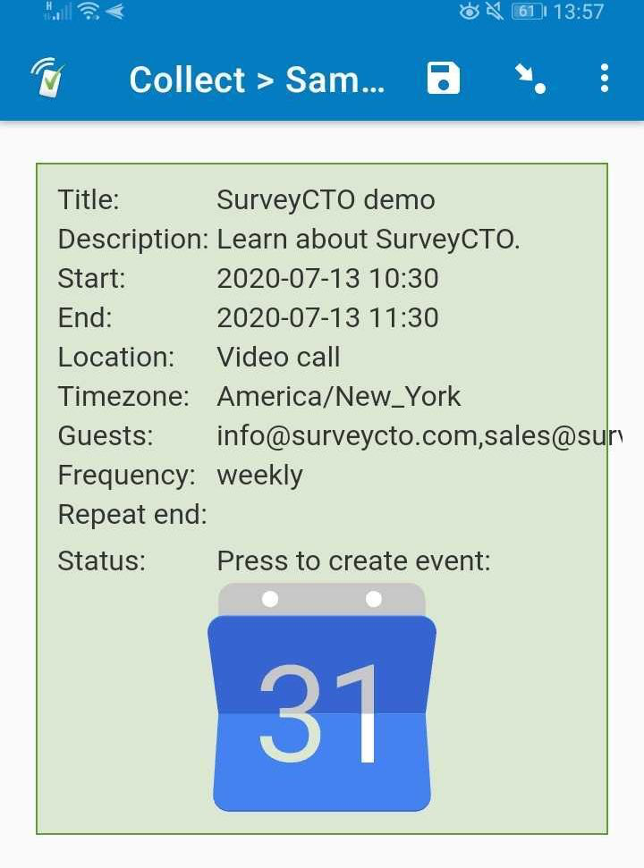

# Create Google Calendar event

## Description

This field plug-in creates Google Calendar events using data entered into SurveyCTO Collect. Use this field plug-in to create calendar events for interview follow-up appointments and other work that needs to be scheduled as part of your data collection.

Supply at least the basic required parameters, `title` and `start_date` to generate an event. This works offline on SurveyCTO Collect on Android.

**Note:** Support for iOS is pending in the current field plug-in version.

## Features

Supports the `text` field type, but doesn't provide an actual text input.

## How the response is stored

Depending on the parameters that were supplied, a response like the following will be stored:

> [2020/07/04, 15:38:45] The following parameters were used: My birthday;Barbecue with friends and family. ;2020-09-01 17:00;2020-09-01 21:00;12 Country Lane;;Africa/Johannesburg;;;.

The date and time in the square brackets at the start is a timestamp for pressing the event creation button, and does not confirm that the event was actually created.

## How to use

1. Download either the [basic sample form](https://github.com/surveycto/create-google-event/raw/master/extras/sample-form/Sample%20form%20-%20Create%20Google%20Calendar%20event%20field%20plug-in%20(basic).xlsx) or the [advanced sample form](https://github.com/surveycto/create-google-event/raw/master/extras/sample-form/Sample%20form%20-%20Create%20Google%20Calendar%20event%20field%20plug-in%20(advanced).xlsx) from this repo and upload it to your SurveyCTO server.
2. Download the [create-google-event.fieldplugin.zip](https://github.com/SurveyCTO/create-google-event/raw/just-browser/phone-call-dialer.fieldplugin.zip) file from this repo, and attach it to the sample form on your SurveyCTO server.
3. Make sure to provide the correct parameters (see below).
4. In a form, press the Google Calendar icon button to generate an event. 
5. In SurveyCTO Collect, pick the Google Calendar app if prompted to complete the action to create an event offline.

## Parameters

| Key | Value |
| --- | --- |
| `title` (required)| Event title. |
| `start_date` (required)| Date and time in YYYY-MM-DD HH:MM format or date in YYYY-MM-DD format if it is an all-day or multi-day event. Use the [`format-date-time()` SurveyCTO function]([https://docs.surveycto.com/02-designing-forms/01-core-concepts/09.expressions.html#format-date-time](https://docs.surveycto.com/02-designing-forms/01-core-concepts/09.expressions.html#format-date-time)) to format correctly.|
| `end_date` (optional)| If not specified defaults to the same as the start date and time plus one hour if a time part is specified. If specified, must be the same as or later than the start date and time. If the `start_date` has no time value, then `end_date` must also have no time value. |
| `description` (optional)| The event description. |
| `location` (optional)| Adding a valid address into the location field enables features such as "time to leave" or displaying a map with directions. |
| `guests` (optional)| A commas-separated list of valid email addresses to invite to the event. |
| `timezone` (optional)| Set to current timezone from the device or browser by default. Alternatively, use the TZ database name values from [this article](https://en.wikipedia.org/wiki/List_of_tz_database_time_zones) |
| `repeat_freq` (optional)| String value [daily, weekly, monthly, yearly]. Will override `repeat_days`. |
| `repeat_days` (optional)| [Sun Mon Tue Wed Thu Fri Sat] specified in a space-separated list (like what is stored by a *select_multiple* field). Do not use simultaneously with `repeat_freq`. |
| `repeat_end` (optional)| Specify either an integer for number of occurrences, or an end date for repeats in YYYY-MM-DD format. Applies to `repeat_freq` and `repeat_days`.|

## More resources

* **Basic sample form**  
[extras/sample-form/basic](https://github.com/surveycto/create-google-event/raw/master/extras/sample-form/Sample%20form%20-%20Create%20Google%20Calendar%20event%20field%20plug-in%20(basic).xlsx)
* **Advanced sample form**  
[extras/sample-form/advanced](https://github.com/surveycto/create-google-event/raw/master/extras/sample-form/Sample%20form%20-%20Create%20Google%20Calendar%20event%20field%20plug-in%20(advanced).xlsx)
* **Developer documentation**  
Instructions and resources for developing your own field plug-ins.  
[https://github.com/surveycto/Field-plug-in-resources](https://github.com/surveycto/Field-plug-in-resources)
* **User documentation**  
How to get started using field plug-ins in your SurveyCTO form.  
[https://docs.surveycto.com/02-designing-forms/03-advanced-topics/06.using-field-plug-ins.html](https://docs.surveycto.com/02-designing-forms/03-advanced-topics/06.using-field-plug-ins.html)