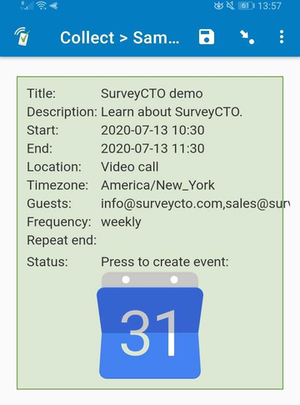

# Create Google Calendar event

This field plug-in creates a Google Calendar events using data entered into SurveyCTO Collect. Use this field plug-in to create calendar events for interview follow-up appointments and other work that needs to be scheduled as part of your data collection.

Only the `title` parameter is required, with the others being optional, but it is recommended that you also supply the `start_date` parameter when generating an event. This also works offline in SurveyCTO Collect on Android.

When using this field plug-in in web forms, keep in mind that the date selected will be converted to UTC time (to learn more, check out our support article on [constraining time fields in form designs
](https://support.surveycto.com/hc/en-us/articles/360045912114-Constraining-time-fields-in-form-designs)). Because of this, when using this field plug-in in web forms, select the "Greenwich" time zone. That way, when the Google Calendar app is opened, it will be converted back to the local time zone.

**Note:** Support for iOS is pending in the current field plug-in version.

*This plug-in is currently in beta. If you you find a problem with the field plug-in, please create an issue in this repo, or email max@surveycto.com.*

### Feature list

 * Create an event in Google Calendar by clicking/tapping a button
 * Customization of the event based on field plug-in parameters

### Data format

Depending on the parameters that were supplied, a response like the following will be stored:

> [2020/07/04, 15:38:45] The following parameters were used: My birthday;Barbecue with friends and family. ;2020-09-01 17:00;2020-09-01 21:00;12 Country Lane;;Africa/Johannesburg;;;.

The date and time in the square brackets at the start is a timestamp when the event creation button was pressed, and does not confirm that the event was actually created.

## How to use

### Getting started

1. Download either the [basic sample form](https://github.com/surveycto/create-google-event/raw/master/extras/sample-form/Sample%20form%20-%20Create%20Google%20Calendar%20event%20field%20plug-in%20(basic).xlsx) or the [advanced sample form](https://github.com/surveycto/create-google-event/raw/master/extras/sample-form/Sample%20form%20-%20Create%20Google%20Calendar%20event%20field%20plug-in%20(advanced).xlsx) from this repo and upload it to your SurveyCTO server.
2. Download the [create-google-event.fieldplugin.zip](https://github.com/SurveyCTO/create-google-event/raw/just-browser/phone-call-dialer.fieldplugin.zip) file from this repo, and attach it to the sample form on your SurveyCTO server.
3. Make sure to provide the correct parameters (see below).
4. In a form, press the Google Calendar icon button to generate an event. 
5. In SurveyCTO Collect, pick the Google Calendar app if prompted to complete the action to create an event offline.
6. Save the Google Calendar event, then return to Collect.

### Parameters

| Key | Value |
| --- | --- |
| `title`| Event title. |
| `start_date`| Date and time in YYYY-MM-DD HH:MM format, or date in YYYY-MM-DD format if it is an all-day or multi-day event. Use the [`format-date-time()` SurveyCTO function]([https://docs.surveycto.com/02-designing-forms/01-core-concepts/09.expressions.html#format-date-time](https://docs.surveycto.com/02-designing-forms/01-core-concepts/09.expressions.html#format-date-time)) to format correctly. If not specified, then the time will be the next half-hour (e.g. if the event is created at 4:14 PM, then the default time will be 4:30 PM).|
| `end_date`| If not specified, defaults to one hour after the `start_date`. If specified, must be the same as or later than the start date and time. If the `start_date` has no time value, then `end_date` must also have no time value. |
| `description`| The event description. |
| `location`| Adding a valid address into the location field enables features such as "time to leave" or displaying a map with directions. |
| `guests`| A commas-separated list of valid email addresses to invite to the event. |
| `timezone`| Set to current timezone from the device or browser by default. Alternatively, use the TZ database name values from [this article](https://en.wikipedia.org/wiki/List_of_tz_database_time_zones) |
| `repeat_freq`| String value ['daily', 'weekly', 'monthly', or 'yearly']. Will override `repeat_days`. |
| `repeat_days`| A space-separated list of days the event should repeat on. Can use values 'Sun', 'Mon', 'Tue', 'Wed', 'Thu', 'Fri', or 'Sat' (e.g. `'Mon Tue'` for repeating on Mondays and Tuesdays). Do not use simultaneously with `repeat_freq`. |
| `repeat_end`| Specify either an integer for number of occurrences, or an end date for repeats in YYYY-MM-DD format. Applies to `repeat_freq` and `repeat_days`.|

### Default SurveyCTO feature support

| Feature / Property | Support |
| --- | --- |
| Supported field type(s) | `text`|
| Default values | No |
| Read only | No |
| media:image | No |
| media:audio | No |
| media:video | No |
| `numbers` appearance | No |
| `numbers-decimal` appearance | No |
| `numbers-phone` appearance | No |

## More resources

* **Basic sample form**  
[extras/sample-form/basic](https://github.com/surveycto/create-google-event/raw/master/extras/sample-form/Sample%20form%20-%20Create%20Google%20Calendar%20event%20field%20plug-in%20(basic).xlsx)
* **Advanced sample form**  
[extras/sample-form/advanced](https://github.com/surveycto/create-google-event/raw/master/extras/sample-form/Sample%20form%20-%20Create%20Google%20Calendar%20event%20field%20plug-in%20(advanced).xlsx)
* **Developer documentation**  
Instructions and resources for developing your own field plug-ins.  
[https://github.com/surveycto/Field-plug-in-resources](https://github.com/surveycto/Field-plug-in-resources)
* **User documentation**  
How to get started using field plug-ins in your SurveyCTO form.  
[https://docs.surveycto.com/02-designing-forms/03-advanced-topics/06.using-field-plug-ins.html](https://docs.surveycto.com/02-designing-forms/03-advanced-topics/06.using-field-plug-ins.html)